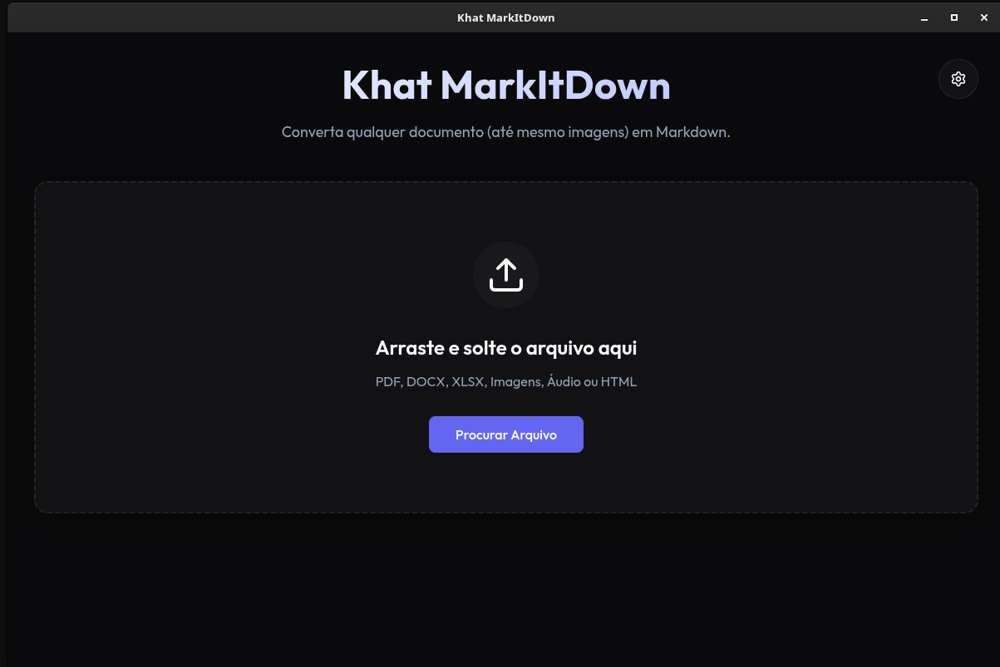
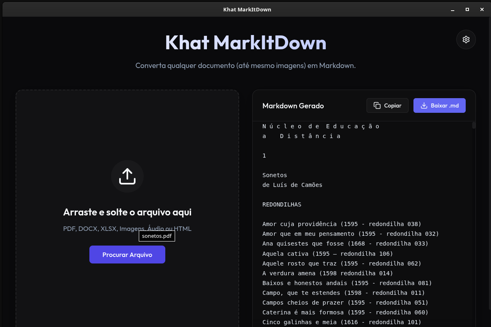

# Khat MarkItDown

<p align="center">
  
  
</p>

> "A principal palavra egípcia antiga para o corpo físico que abriga o espírito é **Khat** (também grafado como Kha). Este termo refere-se especificamente ao corpo material e mortal, sujeito à decomposição, que servia como receptáculo ou 'navio' terreno para as partes imortais da alma (como o Ba e o Ka). É por causa da importância do Khat como âncora para o espírito que os antigos egípcios desenvolveram rituais complexos de mumificação para preservá-lo."

Inspirado nessa mitologia, o **Khat MarkItDown** nasceu com um propósito exato: fornecer um "corpo" visual e acessível. 

Enquanto a robusta biblioteca original [MarkItDown da Microsoft](https://github.com/microsoft/markitdown) atua nos bastidores como o poderoso "espírito" do projeto — operando de forma invisível através de linhas de código e terminais de comando — este projeto é o seu **receptáculo terreno**. 

O **Khat** constrói uma interface gráfica (*GUI*) moderna que materializa esse motor em algo tátil e amigável. Ele abriga a incrível força de conversão documental e extração por IA dentro de um "corpo" visual elegante, permitindo que o imenso poder da ferramenta ganhe forma, se torne duradouro e seja operado por qualquer pessoa sem necessidade de conhecimento em programação.

## Recursos
- **Multi-plataforma**: Construído com Electron, rodando nativamente no Windows, macOS e Linux (.deb, .rpm, .AppImage, flatpak).
- **Design Premium**: Interface baseada em *Glassmorphism* limpa e intuitiva construída com React e Vite.
- **Backend Autônomo**: Processamento via FastAPI no Python, empacotado internamente (Sidecar) via PyInstaller.
- **Suporte a LLM (Inteligência Artificial)**: Basta inserir sua chave de API nas configurações para liberar leitura de imagens e diagramas avançados.
- **Suporte Estendido de Arquivos**: Além dos formatos suportados nativamente pelo motor original (PDF, DOCX, XLSX, PPTX, HTML, CSV, Áudio e Imagens), o **Khat estende a biblioteca da Microsoft**, adicionando interceptadores exclusivos para dar suporte inédito a arquivos do LibreOffice/OpenDocument (`.ods` e `.odt`).

## Estrutura do Projeto
- `/backend`: API Python e script de compilação do sidecar (`build.sh`).
- `/frontend`: Aplicação Vite + React e orquestrador Electron (`main.cjs`).
- `/suporte`: Documentações e planejamento do projeto.

## Como Rodar Localmente (Desenvolvimento)

### Pré-requisitos
- Node.js
- Python 3.10+

### Setup Rápido
1. Ative o ambiente Python no backend e instale as dependências:
   ```bash
   cd backend
   python -m venv venv
   source venv/bin/activate  # ou venv\Scripts\activate no Windows
   pip install "markitdown[all]" fastapi uvicorn python-multipart pyinstaller openai pandas odfpy openpyxl
   ```
2. Inicie o Electron no modo Dev:
   ```bash
   cd frontend
   npm install
   npm run electron:dev
   ```

## Compilando para Produção (Build)
Para gerar os instaladores e binários nativos de distribuição:
1. Compile o backend em um único executável:
   ```bash
   cd backend && ./build.sh
   ```
2. Empacote com o `electron-builder`:
   ```bash
   cd frontend && npm run electron:build
   ```
Os arquivos finais de instalação estarão dentro de `frontend/release/`.

## Licença e Créditos
Este projeto utiliza e funciona como uma interface gráfica para a biblioteca de código aberto `markitdown` criada pela Microsoft, distribuída sob a Licença MIT. 
Todo o código original de interface (GUI) e infraestrutura presente neste repositório também pode ser utilizado sob a Licença MIT.

---

## ☕ Apoie o Projeto (Doações)
Este projeto é desenvolvido e mantido de forma totalmente independente e de código aberto. Se o **Khat MarkItDown** economizou seu tempo e otimizou seu fluxo de trabalho, considere apoiar o desenvolvimento contínuo fazendo uma doação via **Pix**!

**Chave Pix (Aleatória):**
`0d323a66-4090-4e03-aa6d-889abfac5ee7`

Qualquer valor é imensamente agradecido e ajuda a manter ferramentas livres e gratuitas vivas! ❤️
